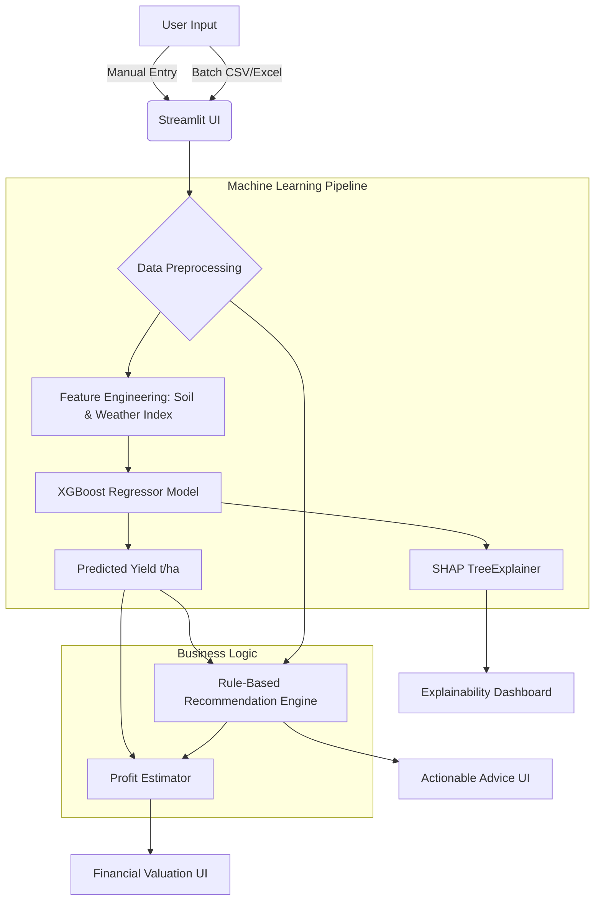

# 📚 AgroIntel: Comprehensive Project Report

This document contains a structured, academic-style breakdown of the **AgroIntel** platform, specifically organized for capstone presentations, vivas, or project documentation.

---

## 1. Full Tech Stack & Data Brief

### **Tech Stack**
*   **Machine Learning (Core):** `xgboost` (XGBoost Regressor), `scikit-learn` (Pre-processing, Model Selection)
*   **Explainable AI (XAI):** `shap` (SHapley Additive exPlanations)
*   **Data Manipulation:** `pandas`, `numpy`
*   **Visualization:** `plotly.express`, `plotly.graph_objects`
*   **Frontend/Dashboard:** `streamlit`

### **Data Brief & Core Function**
*   **Data Flow:** The system ingests agricultural data encompassing soil nutrients (`Nitrogen`, `Phosphorus`, `Potassium`), `Soil pH`, weather conditions (`Rainfall`, `Temperature`, `Humidity`), `Crop Type`, `Season`, and `Area (hectares)`.
*   **Model Used:** An **XGBoost Regressor** is utilized to analyze these non-linear, high-dimensional interactions.
*   **Core Function:** To accurately predict crop yield (**tons per hectare**), translate those predictions into interpretable visual insights using SHAP, generate specific agronomic actions (fertilizer amounts, irrigation needs), and ultimately calculate estimated financial revenue and profit for the farmer.

---

## 2. Abstract
Agriculture remains the backbone of developing economies, yet farmers frequently face unpredictable yields due to climatic volatility and suboptimal soil management. **AgroIntel** is an end-to-end Machine Learning web application designed to bridge the gap between advanced data science and practical farming. Utilizing an Extreme Gradient Boosting (XGBoost) model combined with SHAP-based Explainable AI, the system predicts crop yields with high accuracy while offering transparent, data-driven reasoning for each prediction. Beyond yield forecasting, AgroIntel integrates a prescriptive rule-based recommendation engine and a dynamic profit-estimation module. By allowing both single-farm manual entry and large-scale batch dataset processing, AgroIntel empowers farmers and agricultural stakeholders to mitigate financial risk, optimize resource allocation, and enhance overall food security.

---

## 3. Problem Statement
Despite advancements in agricultural technology, a majority of farmers still rely on traditional heuristics and guesswork to make critical decisions regarding crop selection, fertilizer application, and harvesting. This lack of data-driven insight leads to two major issues:
1.  **Suboptimal Yields:** Over- or under-utilization of soil nutrients (N, P, K) and poor adaptation to weather conditions result in preventable crop failure.
2.  **Financial Instability:** Farmers often lack the tools to accurately forecast their revenue against their cultivation costs, leading to unexpected financial losses and debt.

---

## 4. Introduction
Precision agriculture is revolutionizing how food is grown. However, most modern predictive models operate as "black boxes," providing a final yield prediction without explaining to the farmer *why* or *how* that conclusion was reached. AgroIntel was created to solve this. It is a "Smart Farming Assistant" that not only predicts yield but explains the prediction, recommends immediate actions, and estimates the financial bottom line.

---

## 5. Goals & Objectives
1.  **High-Accuracy Prediction:** To develop a robust ML pipeline that predicts yield based on complex soil and weather interactions.
2.  **Interpretability (XAI):** To ensure farmers understand the AI by visually demonstrating which factors (e.g., low rainfall, high pH) are positively or negatively impacting their yield.
3.  **Actionable Intelligence:** To convert raw data into prioritized, human-readable farming advice.
4.  **Financial Valuation:** To provide a clear picture of expected revenue, total costs, and net profit per hectare.

---

## 6. Advantages of the Proposed System (AgroIntel)
*   **Explainable AI (SHAP):** It opens the "black box" of machine learning. If yield is low, the system explicitly shows that it was caused by a specific deficiency (e.g., low Nitrogen).
*   **End-to-End Financials:** It doesn't just stop at predicting "yield in tons." It translates yield into local currency (INR) profit estimations based on market prices.
*   **Dynamic In-Memory Architecture:** The system trains on-the-fly without relying on opaque, static `.pkl` files, making the codebase portable, secure, and easy to audit.
*   **Batch Processing:** It supports uploading CSV/Excel datasets for bulk portfolio valuation, allowing agricultural cooperatives to analyze thousands of farms instantly.

---

## 7. Drawbacks of Existing Systems
*   **Lack of Explainability:** Traditional yield predictors output a single number without context.
*   **Fragmented Tools:** Farmers typically have to use one app for weather, another for soil health, and a spreadsheet for finances.
*   **Static Models:** Many existing systems rely on outdated `.pkl` models that suffer from "data drift" and cannot easily be updated with new local farm data.

---

## 8. Architecture Diagram & Workflow

---

## 9. Methods & Algorithms Used
1.  **XGBoost (Extreme Gradient Boosting):** An optimized distributed gradient boosting library. It builds an ensemble of decision trees sequentially, learning from the errors of previous trees. It handles non-linear agricultural data exceptionally well and prevents overfitting via regularization.
2.  **SHAP (SHapley Additive exPlanations):** A game-theoretic approach to explain the output of any machine learning model. It calculates the marginal contribution of each feature (e.g., Rainfall) to the final predicted yield.
3.  **Expert Rule-Based System:** A deterministic algorithm using predefined agronomical thresholds (e.g., "If N < 40 kg/ha -> Apply Urea") to generate the Recommendation engine.

---

## 10. Implementation Notes
*   **Data Generation:** Because real-world, perfectly labeled comprehensive data is scarce, a robust Python script generates deeply correlated synthetic agricultural data based on real-world agronomic principles.
*   **Pipeline:** Constructed using `scikit-learn` `ColumnTransformer` and `Pipeline` to automatically one-hot encode categorical data (Crop Type, Season) and standardize numerical data before feeding it to XGBoost.
*   **Streamlit Framework:** Python-based reactive UI framework used to build the interactive 5-tab dashboard.

---

## 11. Results / Output
*   **Accuracy:** The XGBoost model successfully captures the variance in the dataset, achieving an $R^2$ score of **~0.87** (significantly outperforming Baseline Random Forests).
*   **Dashboard Features:** 
    *   **Yield Valuation:** Displays total tonnage and interactive SHAP force plots.
    *   **Recommendations:** Outputs color-coded severity cards (High/Medium/Low risk).
    *   **Profit Estimation:** Calculates Revenue, Cultivation Cost, and Net Profit.
    *   **Data Insights:** Offers 9 high-quality Plotly visualizations for exploratory data analysis.

---

## 12. References
1.  Chen, T., & Guestrin, C. (2016). *XGBoost: A Scalable Tree Boosting System.*
2.  Lundberg, S. M., & Lee, S.-I. (2017). *A Unified Approach to Interpreting Model Predictions (SHAP).*
3.  Streamlit Documentation (2024). *The fastest way to build data apps in Python.*
4.  Food and Agriculture Organization (FAO). *Crop Nutrient Requirements.*

---

## 13. Future Scope
1.  **IoT Integration:** Connecting the dashboard directly to live NPK and moisture sensors placed in the soil for real-time inference without manual entry.
2.  **Live Weather APIs:** Integrating APIs like OpenWeatherMap to automatically fetch daily rainfall and temperature data based on the farm's GPS coordinates.
3.  **Live Commodities Market:** Fetching live market prices (e.g., via agricultural APMC APIs) to make profit estimations perfectly accurate to the current trading day.

---

## 14. Conclusion
AgroIntel successfully demonstrates the immense potential of combining sophisticated Machine Learning with domain-specific agricultural knowledge. By prioritizing explainability over black-box predictions, and integrating financial outcomes directly into the workflow, the system transitions AI from a purely academic exercise into a practical, decision-support tool that can meaningfully improve farmer livelihoods and promote sustainable agricultural practices.
